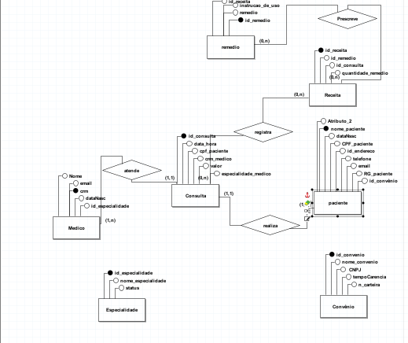
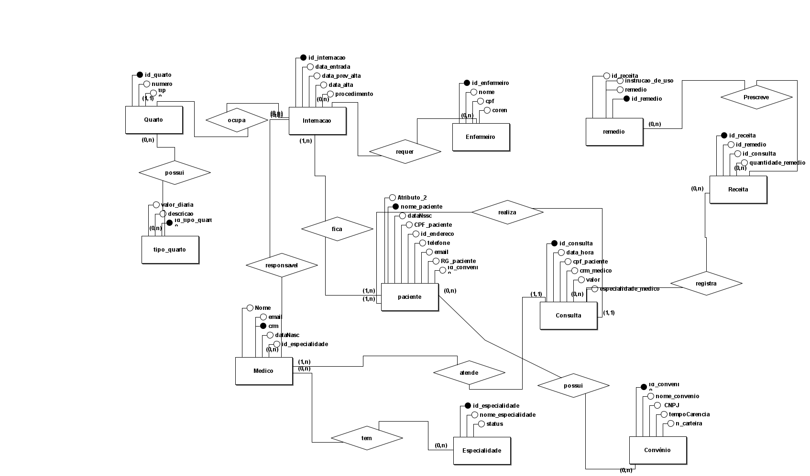

# 🏥 Projeto Banco de Dados – Sistema Hospitalar  


## 📘 Descrição  
Este projeto tem como objetivo criar o modelo de banco de dados para um **hospital**, permitindo o controle de **médicos, pacientes, convênios, consultas e receitas**.  

---
## 📘 PARTE 1 – Modelagem Inicial  

O sistema foi pensado para informatizar o controle clínico e substituir planilhas e formulários de papel,, tornando o sistema mais seguro e eficiente.


### **Requisitos levantados:**
- Cadastro de médicos (generalistas, especialistas ou residentes);
- Registro de especialidades (pediatria, clínica geral, gastroenterologia, dermatologia);
- Cadastro de pacientes com dados pessoais, documentos e convênio;
- Registro de convênios com nome, CNPJ e tempo de carência;
- Controle de consultas, incluindo data, hora, médico, paciente, convênio e especialidade;
- Geração e registro de receitas médicas com medicamentos, quantidade e instruções de uso.

---

## 🧩 Modelo Entidade-Relacionamento  
O diagrama abaixo representa o modelo criado com base nos requisitos do exercício:



> Diagrama desenvolvido no **BRModelo**.

---

## 🗃️ Entidades Principais  
- **Médico:** nome, CRM, especialidade, e-mail, data de nascimento.  
- **Paciente:** nome, CPF, RG, endereço, telefone, e-mail.  
- **Convênio:** nome, CNPJ, tempo de carência.  
- **Consulta:** data, hora, médico, paciente, valor e convênio.  
- **Receita:** medicamentos, quantidade e instruções de uso.

---
## ⚙️ PARTE 2 – Expansão e Modelo Lógico  

Nesta etapa, o diagrama foi ampliado para incluir **novas entidades** e permitir o controle completo das **internações hospitalares**.  
Foram adicionados:
- **Internação** (data de entrada, alta prevista e efetiva, procedimentos);
- **Quarto** (numeração e tipo);
- **Tipo de Quarto** (descrição e valor diário);
- **Enfermeiro(a)** (nome, CPF, COREN);
- Relacionamento entre **Internação**, **Paciente**, **Médico** e **Enfermeiro**.

---

### **Diagrama ER – Parte 2**


---

### **Modelo Lógico e Script SQL**

A seguir, o script SQL gerado com base no diagrama final.  
O script completo também está disponível no arquivo **hospital-modelo-logico.sql** deste repositório.

```sql

-- ==========================================================
-- Banco de Dados Hospital
-- Criação das tabelas 
-- ==========================================================

DROP DATABASE IF EXISTS hospital;
CREATE DATABASE hospital;
USE hospital;

-- ==========================================================
-- ENTIDADE: Endereco
-- Cada paciente terá um endereço
-- ==========================================================
CREATE TABLE Endereco (
    id_endereco INT AUTO_INCREMENT PRIMARY KEY,
    pais VARCHAR(80),
    rua VARCHAR(100) NOT NULL,
    numero VARCHAR(10),
    bairro VARCHAR(50),
    cidade VARCHAR(50),
    estado CHAR(2),
    complemento VARCHAR(110),
    cep VARCHAR(10)
);

-- ==========================================================
-- ENTIDADE: Especialidade
-- cada medico tem uma especialidade
-- ==========================================================
CREATE TABLE Especialidade (
    id_especialidade INT AUTO_INCREMENT PRIMARY KEY,
    nome_especialidade VARCHAR(100) NOT NULL,
    status TINYINT DEFAULT 1
);

-- ==========================================================
-- ENTIDADE: Medico
-- 
-- ==========================================================
CREATE TABLE Medico (
    id_medico INT AUTO_INCREMENT PRIMARY KEY,
    nome VARCHAR(100) NOT NULL,
    crm INT UNIQUE NOT NULL,
    email VARCHAR(100),
    data_nasc DATE,
    id_especialidade INT,
    em_atividade BOOLEAN DEFAULT TRUE,
    FOREIGN KEY (id_especialidade) REFERENCES Especialidade(id_especialidade)
);

-- ==========================================================
-- RELACIONAMENTO: Medico ↔ Especialidade (muitos-para-muitos)
-- ==========================================================
CREATE TABLE Tem (
    fk_medico_id INT NOT NULL,
    fk_especialidade_id INT NOT NULL,
    data_inicio DATE,
    PRIMARY KEY(fk_medico_id, fk_especialidade_id),
    FOREIGN KEY(fk_medico_id) REFERENCES Medico(id_medico) ON DELETE CASCADE ON UPDATE CASCADE,
    FOREIGN KEY(fk_especialidade_id) REFERENCES Especialidade(id_especialidade) ON DELETE CASCADE ON UPDATE CASCADE
);

-- ==========================================================
-- ENTIDADE: Convenio
-- Ao menos quatro convênios médicos
-- ==========================================================
CREATE TABLE Convenio (
    id_convenio INT AUTO_INCREMENT PRIMARY KEY,
    nome_convenio VARCHAR(100) NOT NULL,
    cnpj VARCHAR(20),
    tempo_carencia VARCHAR(50),
    n_carteira varchar(50)
);

-- ==========================================================
-- ENTIDADE: Paciente
-- Ao menos 15 pacientes
-- ==========================================================
CREATE TABLE Paciente (
    id_paciente INT AUTO_INCREMENT PRIMARY KEY,
    nome_paciente VARCHAR(100) NOT NULL,
    data_nasc DATE,
    cpf_paciente VARCHAR(15) UNIQUE NOT NULL,
    id_endereco INT,
    telefone VARCHAR(15),
    email VARCHAR(100),
    rg_paciente VARCHAR(15),
    id_convenio INT,
    FOREIGN KEY (id_endereco) REFERENCES Endereco(id_endereco) ON DELETE SET NULL ON UPDATE CASCADE,
    FOREIGN KEY (id_convenio) REFERENCES Convenio(id_convenio) ON DELETE SET NULL ON UPDATE CASCADE
);

-- ==========================================================
-- ENTIDADE: Consulta
-- Cada consulta tem paciente, médico e convênio
-- ==========================================================
CREATE TABLE Consulta (
    id_consulta INT AUTO_INCREMENT PRIMARY KEY,
    data_hora DATETIME NOT NULL,
    id_paciente INT NOT NULL,
    id_medico INT NOT NULL,
    id_convenio INT,
    valor DECIMAL(10,2),
    FOREIGN KEY(id_paciente) REFERENCES Paciente(id_paciente),
    FOREIGN KEY(id_medico) REFERENCES Medico(id_medico),
    FOREIGN KEY(id_convenio) REFERENCES Convenio(id_convenio)
);

-- ==========================================================
-- ENTIDADE: Remedio
-- ==========================================================
CREATE TABLE Remedio (
    id_remedio INT AUTO_INCREMENT PRIMARY KEY,
    nome_remedio VARCHAR(100) NOT NULL,
    tipo_remedio VARCHAR(50),
    descricao_composicao VARCHAR(255)
);

ALTER TABLE Remedio 
ADD COLUMN quantidade_embalagem VARCHAR(50);

-- ==========================================================
-- ENTIDADE: Receita
-- Cada receita está ligada a uma consulta
-- ==========================================================
CREATE TABLE Receita (
    id_receita INT AUTO_INCREMENT PRIMARY KEY,
    id_consulta INT NOT NULL,
    observacao VARCHAR(255),
    status ENUM('emitida','entregue','cancelada') DEFAULT 'emitida',
    FOREIGN KEY(id_consulta) REFERENCES Consulta(id_consulta)
);

alter table receita add column quantidade_remedio int;
-- ==========================================================
-- RELACIONAMENTO: Prescreve (Receita ↔ Remédio)
-- 
-- ==========================================================
CREATE TABLE Prescreve (
    fk_receita_id INT NOT NULL,
    fk_remedio_id INT NOT NULL,
    quantidade INT,
    instrucao_de_uso VARCHAR(255),
    PRIMARY KEY(fk_receita_id, fk_remedio_id),
    FOREIGN KEY(fk_receita_id) REFERENCES Receita(id_receita) ON DELETE CASCADE ON UPDATE CASCADE,
    FOREIGN KEY(fk_remedio_id) REFERENCES Remedio(id_remedio) ON DELETE CASCADE ON UPDATE CASCADE
);

-- ==========================================================
-- ENTIDADE: Tipo_Quarto
-- 
-- ==========================================================
CREATE TABLE Tipo_Quarto (
    id_tipo_quarto INT AUTO_INCREMENT PRIMARY KEY,
    descricao ENUM('Apartamento','Quarto Duplo','Enfermaria','VIP','Compartilhado') NOT NULL,
    valor_diaria DECIMAL(10,2) NOT NULL
);

-- ==========================================================
-- ENTIDADE: Quarto
-- ==========================================================
CREATE TABLE Quarto (
    id_quarto INT AUTO_INCREMENT PRIMARY KEY,
    numero VARCHAR(10) NOT NULL,
    id_tipo_quarto INT,
    FOREIGN KEY(id_tipo_quarto) REFERENCES Tipo_Quarto(id_tipo_quarto)
);

-- ==========================================================
-- ENTIDADE: Enfermeiro
-- ==========================================================
CREATE TABLE Enfermeiro (
    id_enfermeiro INT AUTO_INCREMENT PRIMARY KEY,
    nome VARCHAR(100) NOT NULL,
    cpf VARCHAR(15),
    coren VARCHAR(20)
);

-- ==========================================================
-- ENTIDADE: Internacao
-- Chaves estrangeiras: Médico, Paciente, Quarto
-- ==========================================================
CREATE TABLE Internacao (
    id_internacao INT AUTO_INCREMENT PRIMARY KEY,
    data_entrada DATE NOT NULL,
    data_prev_alta DATE,
    data_alta DATE,
    procedimento VARCHAR(255),
    fk_quarto_id INT NOT NULL,
    fk_id_paciente INT NOT NULL,
    fk_id_medico INT NOT NULL,
    FOREIGN KEY(fk_quarto_id) REFERENCES Quarto(id_quarto),
    FOREIGN KEY(fk_id_paciente) REFERENCES Paciente(id_paciente),
    FOREIGN KEY(fk_id_medico) REFERENCES Medico(id_medico)
);

-- ==========================================================
-- RELACIONAMENTO: Internacao ↔ Enfermeiro
-- ==========================================================
CREATE TABLE Requer (
    fk_internacao_id INT NOT NULL,
    fk_enfermeiro_id INT NOT NULL,
    PRIMARY KEY(fk_internacao_id, fk_enfermeiro_id),
    FOREIGN KEY(fk_internacao_id) REFERENCES Internacao(id_internacao) ON DELETE CASCADE ON UPDATE CASCADE,
    FOREIGN KEY(fk_enfermeiro_id) REFERENCES Enfermeiro(id_enfermeiro) ON DELETE CASCADE ON UPDATE CASCADE
);


 ---
 ```
---

## 🧩 PARTE 3 – ALIMENTANDO O BANCO DE DADOS

Nesta etapa, o banco de dados do **Hospital** foi populado com dados completos, respeitando todas as regras do enunciado e os relacionamentos definidos anteriormente.

Foram inseridos registros em todas as tabelas principais:  
`Paciente`, `Médico`, `Especialidade`, `Convênio`, `Consulta`, `Internação`, `Receita`, `Remédio` e nas tabelas de relacionamento.

## 🧩 PARTE 3 – Alimentando o Banco de Dados

A seguir está o resumo das inserções realizadas no banco de dados **Hospital**.  
O script completo com todas as inserções está disponível no arquivo  
📂 **insert_data_hospital.sql** deste repositório.

```sql
-- ==========================================================
-- PARTE 3 – INSERÇÃO DE DADOS NO BANCO DE DADOS HOSPITAL
-- ==========================================================

-- Inserção de Especialidades
INSERT INTO especialidade (id_especialidade, nome_especialidade) VALUES
(1, 'Pediatria'),
(2, 'Clínica Geral'),
(3, 'Cardiologia'),
(4, 'Dermatologia'),
(5, 'Gastroenterologia'),
(6, 'Neurologia'),
(7, 'Ortopedia');

-- Inserção de Médicos
INSERT INTO medico (id_medico, nome, crm, id_especialidade) VALUES
(1, 'Dr. Rafael Santos', 'CRM12345', 2),
(2, 'Dra. Camila Oliveira', 'CRM54321', 1),
(3, 'Dr. João Mendes', 'CRM67890', 4),
(4, 'Dra. Luana Ribeiro', 'CRM34567', 3),
(5, 'Dr. Pedro Almeida', 'CRM98765', 5);

-- Inserção de Pacientes
INSERT INTO paciente (id_paciente, nome, cpf, data_nascimento, telefone, id_endereco)
VALUES
(1, 'Maria Silva', '12345678901', '1990-04-15', '(11) 98877-6655', 1),
(2, 'Carlos Souza', '98765432100', '1985-08-22', '(11) 97788-5544', 2),
(3, 'Ana Costa', '55544433322', '1995-03-30', '(11) 98899-2211', 3);

-- Inserção de Convênios
INSERT INTO convenio (id_convenio, nome_convenio, cobertura) VALUES
(1, 'Saúde Total', 'Completa'),
(2, 'Vida Plus', 'Ambulatorial e hospitalar'),
(3, 'MedCare', 'Básica');

-- Inserção de Consultas
INSERT INTO consulta (id_consulta, data_consulta, hora_consulta, id_medico, id_paciente, id_convenio)
VALUES
(1, '2021-05-12', '09:30', 1, 1, 1),
(2, '2022-03-15', '14:00', 2, 2, 2),
(3, '2020-11-20', '10:15', 3, 3, 3);

-- Inserção de Remédios
INSERT INTO remedio (id_remedio, nome_remedio, tipo, quantidade_embalagem)
VALUES
(1, 'Paracetamol', 'Comprimido', '20 comprimidos'),
(2, 'Dipirona', 'Gotas', '30 ml'),
(3, 'Amoxicilina', 'Cápsula', '12 unidades'),
(4, 'Xarope Infantil', 'Xarope', '120 ml'),
(5, 'Pomada Antisséptica', 'Pomada', '30 g');

-- Inserção de Receitas
INSERT INTO receita (id_receita, id_consulta, data_emissao, observacoes)
VALUES
(1, 1, '2021-05-12', 'Tomar os medicamentos conforme prescrição.'),
(2, 2, '2022-03-15', 'Evitar exposição solar.'),
(3, 3, '2020-11-20', 'Seguir dieta leve durante o tratamento.');

-- Inserção de Prescrições (tabela prescreve)
INSERT INTO prescreve (id_receita, id_remedio, dosagem, frequencia, duracao, observacoes)
VALUES
(1, 1, '500mg', 'A cada 8 horas', '5 dias', 'Tomar após as refeições.'),
(1, 2, '20 gotas', 'A cada 6 horas', '3 dias', 'Diluir em meio copo de água.'),
(2, 4, '10ml', 'A cada 12 horas', '7 dias', 'Agitar antes de usar.'),
(3, 3, '1 cápsula', 'A cada 8 horas', '10 dias', 'Não interromper antes do prazo.');

-- ==========================================================
-- Sobre o Projeto
-- ==========================================================
-- Este banco de dados foi desenvolvido para simular um sistema hospitalar,
-- incluindo pacientes, médicos, consultas, convênios, receitas e medicamentos.
-- O script acima representa parte do processo de alimentação do banco.
-- Para ver todas as inserções, acesse o arquivo hospital-insert-parte3.sql
-- Script validado no MySQL Workbench 8.0

---
```

### 📜 Enunciado

- Incluir **ao menos dez médicos** de diferentes especialidades.  
- Cadastrar **sete especialidades**, incluindo *pediatria, clínica geral, gastrenterologia e dermatologia*.  
- Inserir **quinze pacientes** com convênios variados.  
- Registrar **vinte consultas (2015–2022)**, sendo **ao menos dez** com duas ou mais receitas.  
- Adicionar **quatro convênios médicos** associados a pacientes e consultas.  
- Criar relacionamentos entre **médico ↔ especialidade** e **internação ↔ enfermeiro**.  
- Incluir **chaves estrangeiras de médico e paciente** em `Internacao`.  
- Registrar **sete internações**, com pacientes repetidos e quartos variados.  
- Adicionar **três tipos de quarto**: apartamento, duplo e enfermaria, com valores distintos.  
- Cadastrar **dez enfermeiros**, associando ao menos dois a cada internação.  
- Povoados iniciais obrigatórios: **tipo de quarto**, **convênio** e **especialidade**.

---


## 🧠 Ferramentas Utilizadas

- **BRModelo** – Criação do diagrama ER  
- **MySQL** – Criação e execução do banco de dados  
- **GitHub** – Versionamento e entrega da atividade  

---

### 👩‍💻 Desenvolvido por
**Emile Neres Batista**

**Professor:** * [Gabriel Augusto](https://github.com/gabaugusto) *   
**Curso:** Instituto PROA – Projeto de Banco de Dados
 
**Curso:** *Instituto PROA – Projeto de Banco de Dados*  

